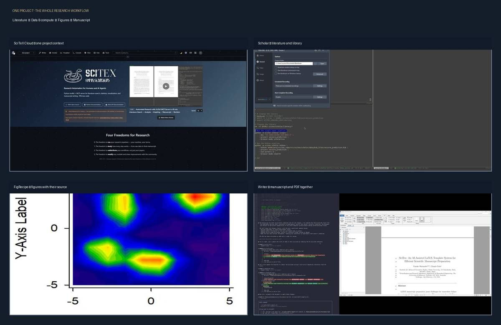
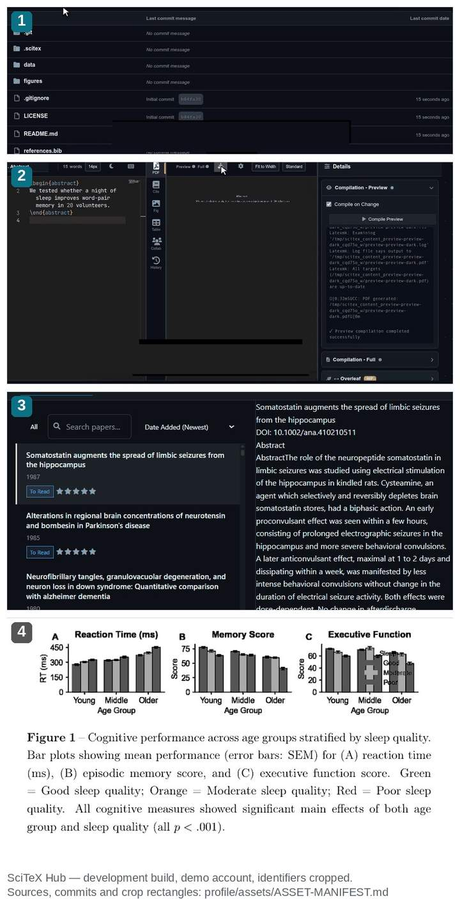

<p align="center">
  <a href="https://scitex.ai"></a>
</p>

<p align="center">
  <b>すべての結果は、それを生み出したデータとコードまでたどれるべきです。</b>
</p>

<p align="center">
  <a href="https://pypi.org/project/scitex/"></a>
  <a href="https://pypi.org/project/scitex/"></a>
  <a href="https://scitex.ai"></a>
  
</p>

<p align="center">
  <a href="README.md">English</a> · <b>日本語</b>
</p>

---

## 具体的な問題

査読者から、2023年に発表した論文の Figure 3 の解析根拠を求められました。図は PDF
の中にあります。スクリプトは `final_v2_fixed` というディレクトリにあります。乱数シー
ドは誰も覚えていません — そして同じスクリプトを走らせても、キャプションに書いた値は
戻ってきません。論文自体が間違っているわけではありません。ただ、図から、それを生み
出したコードとデータへ至る道が存在しないだけです。

この組織が作っているのは、その欠落に対する道具です。より良いノートブックでも、より
良い描画ライブラリでもなく、生データから査読者が検証できる原稿までの、たどれる道筋
です。

## 全体像

SciTeX は、ひとつの研究プロジェクトを中心に、専門化したインターフェイスを配置します。

```text
                           SciTeX Clew
                    provenance と drift を検証
                                  │
  Scholar ───── 文献 ─────┐       │       ┌── データとファイル ─ Storage
                          │       ▼       │
  Stats ─────── 解析 ─────┼── SciTeX Hub ─┼── 図 ─────────────── FigRecipe
                          │  one project  │
  Agents + Chat ─ command┘    context    └── 原稿 + PDF ─────── Writer
                                  │
                             Custom Apps
                    同じ project contract を拡張
```

中心にあるのは新しいファイル形式ではありません。共有された project、identity、storage、
command の層です。組み込みアプリを携帯やブラウザから使い、計算機へ SSH して作業し、
研究プロジェクトを複製せずに custom app を追加できます。

<p align="center">
  <a href="https://scitex.ai"></a>
</p>

4 枚はモックアップではなく、実際の SciTeX Cloud 開発画面です。Hub の project 画面、
Scholar の文献 workflow、FigRecipe の図出力、Writer の source/PDF workspace を示します。
source video の hash と取得条件は
[`profile/assets/ASSET-MANIFEST.md`](assets/ASSET-MANIFEST.md) にあります。

## ひとつのプロジェクトで、端から端まで

<p align="center">
  <a href="https://scitex.ai"></a>
</p>

実際に動いている SciTeX の画面と出力を、プロジェクトが進む順に 4 枚並べたものです。

1. **Hub 上のプロジェクト** — `data/`、`figures/`、`references.bib` が原稿と同じ場所に
   あります。4 つのツールと 4 つのコピーではなく、1 つのプロジェクトです。
2. **Writer** — ブラウザ上で LaTeX を書き、コンパイラのログは
   *Preview compilation completed successfully* で終わります。書き出して再アップロード
   する工程はありません。
3. **Scholar** — 実際に中身の入った書誌ライブラリ。詳細ペインには DOI と Abstract が
   表示されています。
4. **原稿 PDF に取り込まれた図** —
   [automated-research-demo](https://github.com/scitex-ai/automated-research-demo) の
   Figure 1 です。合成データによる睡眠 × 年齢の検討（N=180）を、1 回のエージェント実
   行が約 40 分でデータから原稿まで運んだ結果です。

4 枚はいずれも**開発ビルド**の画面で、使い捨てのデモアカウントで取得しました。識別情
報 — ブラウザの UI、アカウント名とプロジェクト名、アバター — はすべて切り落とし、録
画に焼き込まれていたチュートリアル用の吹き出しは塗りつぶしています。出典・コミット・
日付・ハッシュ・伏せた内容の一覧は
[`profile/assets/ASSET-MANIFEST.md`](assets/ASSET-MANIFEST.md) にあります。画像の再生成
は [`scripts/build_profile_proof.py`](https://github.com/scitex-ai/.github/blob/main/scripts/build_profile_proof.py)
です。モックアップは 1 枚もなく、本番環境の画面も 1 枚もありません。
[自動実行の録画を見る](https://scitex.ai/demos/watch/scitex-automated-research/) ·
[出力を読む](https://github.com/scitex-ai/automated-research-demo)。

## 60 秒

```bash
uv venv .venv && uv pip install scitex   # 初回はキャッシュなしで約 45 秒、キャッシュありで約 2 秒
```

```python
# quick.py — 2 群、1 検定、1 図
import numpy as np
import scitex as stx

rng = np.random.default_rng(0)
good, poor = rng.normal(60, 8, 60), rng.normal(52, 8, 60)

r = stx.stats.test_ttest_ind(good, poor)
print(f"p = {r['pvalue']:.2e}  d = {r['effect_size']:.2f}  power = {r['power']:.2f}")

fig, ax = stx.plt.subplots()
ax.bar(["good", "poor"], [good.mean(), poor.mean()], yerr=[good.std(), poor.std()])
stx.io.save(fig, "quickstart.png")
```

```console
$ .venv/bin/python quick.py
p = 1.17e-07  d = 1.03  power = 1.00
SUCC: Saved: ./quick_out/quickstart.{png,yaml} (Reproducibility Validation: PASSED)
```

注目すべきは YAML のほうです。図を保存すると、そのレシピも一緒に書き出されます — ミリ
単位のレイアウト、matplotlib のバージョン、そして描画に使った値が CSV として隣に並び
ます。ノートブックがなくても、図を描き直し、数値を検算できます。`scitex` は PyPI に
あり、`requires-python >= 3.10`。上の実行結果は Python 3.12、seed 0 の実測です。

## 中核となるリポジトリ

| パッケージ | 内容 |
|---|---|
| [**scitex**](https://github.com/scitex-ai/scitex-python) | 総合パッケージ。`import scitex as stx` ひとつで 72 個のサブモジュール — `stx.stats`、`stx.plt`、`stx.io`、`stx.session`、`stx.scholar` など — と、エージェント向けの MCP ツールが使えます。まずここから。 |
| [**scitex-scholar**](https://github.com/scitex-ai/scitex-scholar) | 文献：検索・メタデータ補完・PDF 取得・参照管理。 |
| [**figrecipe**](https://github.com/scitex-ai/figrecipe) | 上の YAML を生んでいるライブラリ。ミリ単位レイアウトと自己記述する図。 |
| [**scitex-writer**](https://github.com/scitex-ai/scitex-writer) | 決まったプロジェクト構成で LaTeX 原稿をコンパイル。MCP サーバー付き。 |
| [**scitex-hub**](https://github.com/scitex-ai/scitex-hub) | Web アプリ本体。scholar・writer・図・アプリを 1 つの Django プロジェクトに。**アルファ**（下の成熟度を参照）。 |
| [**automated-research-demo**](https://github.com/scitex-ai/automated-research-demo) | 上の画像の実行そのもの。スクリプト・原稿 PDF・改訂版 PDF が入っています。 |

ほかに約 65 のパッケージがあります — `scitex-stats`、`scitex-io`、`scitex-hpc`、
`scitex-clew`、`scitex-agent-container` など。それぞれが独立して文書化・ライセンスされ
ており、単体で採用できます。
[**全リポジトリを見る →**](https://github.com/orgs/scitex-ai/repositories)

## ホステッドか、セルフホストか

|  |  |
|---|---|
| **ホステッド** | [scitex.ai](https://scitex.ai) — 動いている Hub です。インストール不要で、Web アプリが何をするものかを一番速く確認できます。 |
| **セルフホスト** | `uv pip install scitex-hub[all]` のあと、自分のマシンやラボのサーバーで Docker を実行します。AGPL-3.0、アカウント登録もベンダーも不要です。 |

上記の Python パッケージ群はどちらも必要としません。ノート PC でオフラインで動きます。
ホステッドの Hub は利便性のためのもので、依存関係ではありません — そして**アルファ**
の部分です（README 自身が、データ形式が変わりうるので重要な作業はバックアップするよ
う注意しています）。今日の信頼性が必要なら、ライブラリをセルフホストし、Hub はプレ
ビューとして扱ってください。

## 貢献・質問・議論

- **質問やアイデア** → [`scitex-python` の Discussions](https://github.com/scitex-ai/scitex-python/discussions)。
  開いていますが、これまでに使われたのは 1 回だけ（歓迎のスレッド）です。2 人目が参
  加すれば、それは会話になります。
- **バグ・機能要望** → 該当パッケージの Issue へ。最小再現があると回答が速くなります。
- **コード** → 各リポジトリが `CONTRIBUTING.md` を持っています。PR は `develop` に向け
  てください。`main` はリリース専用です。最初の 1 回だけ
  [CLA](https://github.com/scitex-ai/scitex-python/blob/main/CLA.md) への同意が必要です。
- **フォークからの PR** は、CI が動く前にメンテナが承認します。フォーク由来のコードは
  セルフホストの計算機上で走らせず、レビュー用のブランチに取り込んでから実行します。
  これは意図的な設計で、理由は
  [このリポジトリの README](https://github.com/scitex-ai/.github/blob/main/README.md)
  に書いてあります。

## いま実際どこにあるのか

2026-09-17 時点の実測値です。良い数字だけを見せるプロフィールは読む価値がないので、
そのまま書きます。

|  |  |
|---|---|
| PyPI の `scitex` | 2.30.8、リリース 86 回、Python ≥ 3.10 |
| 組織 | 2025-05-11 作成 · **フォロワー 6 · 公開メンバー 1** |
| リポジトリ | **公開 75 · うちスター 0 が 59** · ホームページ未設定が 37 |
| スター | 合計 170、うち **121（71%）が 2 リポジトリに集中** — `scitex-python` と `automated-research-demo` |
| コントリビューター | 総合パッケージで 3 アカウント：人間 1（`ywatanabe1989`）、LLM エージェント 1（`LLEmacs`）、GitHub Actions の bot 1 |
| Discussions | スレッド 1 件 |

正直に読めば、まだ若く、実質ひとりで維持され、表面積だけが大きく、コミュニティはまだ
存在しないプロジェクトです。一方で、パッケージごとの文書は異例なほど整っており、パイ
プラインは本当に端から端まで動きます。だからこそ、入り口としては組織全体ではなく
**パッケージ 1 つ**が妥当です。図に悩んでいるなら `figrecipe`、文献に悩んでいるなら
`scitex-scholar` を採り、残りの 73 は居場所を見つけるまで無視してください。API は変わ
りますし、Web の Hub はアルファだと考えてください。

---

<p align="center">
  <a href="https://scitex.ai"></a>
  <br><sub>info@scitex.ai · <a href="README.md">English</a></sub>
</p>
