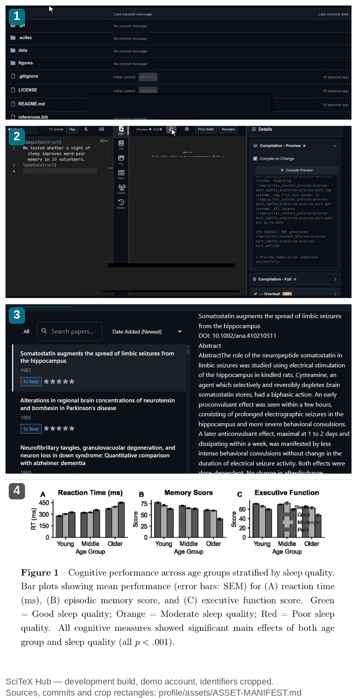

<p align="center">
  <a href="https://scitex.ai"></a>
</p>

<p align="center">
  <b>Every result should trace back to the data and code that produced it.</b>
</p>

<p align="center">
  <a href="https://pypi.org/project/scitex/"></a>
  <a href="https://pypi.org/project/scitex/"></a>
  <a href="https://scitex.ai"></a>
  
</p>

<p align="center">
  <b>English</b> · <a href="README.ja.md">日本語</a>
</p>

---

## The problem, concretely

A reviewer asks for the analysis behind Figure 3 of your 2023 paper. The figure
is in the PDF. The script is in a directory called `final_v2_fixed`. The random
seed is in nobody's memory — and when you run the script again, the number in
the caption does not come back. Nothing in the paper is *wrong*; there is simply
no path from the figure to the code and data that produced it.

That gap is what this organisation builds tooling against. Not a better
notebook, not a better plotting library — a traceable path from raw data to a
manuscript a reviewer can actually check.

## One project, end to end

<p align="center">
  <a href="https://scitex.ai"></a>
</p>

Four crops of real SciTeX surfaces and outputs, in the order a project moves:

1. **A project in the hub** — `data/`, `figures/` and `references.bib` sitting
   beside the manuscript. One project, not four tools with four copies.
2. **Writer** — LaTeX in the browser, and the compiler log ending in
   *Preview compilation completed successfully*. No export-and-reupload step.
3. **Scholar** — a populated library: real records, DOI and abstract in the
   detail pane.
4. **The figures, as compiled into the manuscript PDF** — Figure 1 of
   [automated-research-demo](https://github.com/scitex-ai/automated-research-demo),
   whose bar plots are the output of the synthetic sleep × age study (N=180)
   that one agent run carried from data to a manuscript in about 40 minutes.

All four are **development builds**, captured from a working dev instance with a
throwaway demo account; every identifier — browser chrome, account and project
names, avatar — is cropped out, and the recording's tutorial overlays are
painted over. Sources, commits, dates, hashes and exactly what was redacted are
in [`profile/assets/ASSET-MANIFEST.md`](assets/ASSET-MANIFEST.md). Rebuilding the
composite is [`scripts/build_profile_proof.py`](https://github.com/scitex-ai/.github/blob/main/scripts/build_profile_proof.py).
Nothing in the image is a mockup, and nothing in it is production.
[Watch the automated run](https://scitex.ai/demos/watch/scitex-automated-research/) ·
[Read its outputs](https://github.com/scitex-ai/automated-research-demo).

## Sixty seconds

```bash
uv venv .venv && uv pip install scitex   # first run ≈ 45 s on a cold cache, ≈ 2 s warm
```

```python
# quick.py — two groups, one test, one figure
import numpy as np
import scitex as stx

rng = np.random.default_rng(0)
good, poor = rng.normal(60, 8, 60), rng.normal(52, 8, 60)

r = stx.stats.test_ttest_ind(good, poor)
print(f"p = {r['pvalue']:.2e}  d = {r['effect_size']:.2f}  power = {r['power']:.2f}")

fig, ax = stx.plt.subplots()
ax.bar(["good", "poor"], [good.mean(), poor.mean()], yerr=[good.std(), poor.std()])
stx.io.save(fig, "quickstart.png")
```

```console
$ .venv/bin/python quick.py
p = 1.17e-07  d = 1.03  power = 1.00
SUCC: Saved: ./quick_out/quickstart.{png,yaml} (Reproducibility Validation: PASSED)
```

The YAML is the part worth noticing. Saving a figure also writes its recipe —
layout in millimetres, the matplotlib version, and the plotted values as CSV
next to it — so the figure can be re-rendered and the numbers re-checked
without the notebook that made it. `scitex` is on PyPI, `requires-python >= 3.10`;
the transcript above is a real run on Python 3.12, seed 0.

## The repositories that carry it

| Package | What it is |
|---|---|
| [**scitex**](https://github.com/scitex-ai/scitex-python) | The umbrella package. One `import scitex as stx` exposes 72 submodules — `stx.stats`, `stx.plt`, `stx.io`, `stx.session`, `stx.scholar`, … — plus MCP tools for agents. Start here. |
| [**scitex-scholar**](https://github.com/scitex-ai/scitex-scholar) | Literature: search, enrichment, PDF retrieval, reference management. |
| [**figrecipe**](https://github.com/scitex-ai/figrecipe) | The library behind the YAML above. Matplotlib with millimetre-precision layouts and self-describing figures. |
| [**scitex-writer**](https://github.com/scitex-ai/scitex-writer) | LaTeX manuscript compilation with a defined project structure, plus an MCP server. |
| [**scitex-hub**](https://github.com/scitex-ai/scitex-hub) | The web application: scholar, writer, figures, apps in one Django project. **Alpha** — see maturity below. |
| [**automated-research-demo**](https://github.com/scitex-ai/automated-research-demo) | The run in the image above, with its scripts, manuscript PDF and revision PDF. |

Around 65 further packages — `scitex-stats`, `scitex-io`, `scitex-hpc`,
`scitex-clew`, `scitex-agent-container` — each documented and licensed on its
own, adoptable without the rest.
[**Browse all repositories →**](https://github.com/orgs/scitex-ai/repositories)

## Hosted or self-hosted

|  |  |
|---|---|
| **Hosted** | [scitex.ai](https://scitex.ai) — the hub, running. Zero install, and the fastest way to see what the web app does. |
| **Self-hosted** | `uv pip install scitex-hub[all]`, then Docker on your own machine or lab server. AGPL-3.0, no account, no vendor. |

The Python packages above need neither: they run offline on a laptop. The hosted
hub is a convenience, not a dependency — and it is the **alpha** component
(its own README warns that data formats may change and to back up important
work). If you need reliability today, self-host the library and treat the hub
as a preview.

## Contributing, asking, arguing

- **Questions and ideas** → [Discussions on `scitex-python`](https://github.com/scitex-ai/scitex-python/discussions).
  Open, and so far used once — the welcome thread. A second participant would
  make it a conversation.
- **Bugs and feature requests** → the issue tracker of the package concerned;
  a minimal reproduction gets answered much faster.
- **Code** → each repo ships its own `CONTRIBUTING.md`; PRs target `develop`,
  `main` is release-only. A one-time [CLA](https://github.com/scitex-ai/scitex-python/blob/main/CLA.md)
  is required before a first contribution can be merged.
- **Fork PRs** are approved by a maintainer before CI runs on them, and pull
  requests from forks are checked out into a branch for review rather than run
  on self-hosted infrastructure. That is deliberate; the reasoning is in
  [this repo's README](https://github.com/scitex-ai/.github/blob/main/README.md).

## Where this actually is

Measured 2026-09-17, because a profile page that only shows the good numbers is
not worth reading:

|  |  |
|---|---|
| `scitex` on PyPI | 2.30.8, 86 releases, Python ≥ 3.10 |
| Org | created 2025-05-11 · **6 followers · 1 public member** |
| Repositories | **75 public · 59 with zero stars** · 37 with no homepage set |
| Stars | 170 total, **121 of them (71%) on two repos** — `scitex-python` and `automated-research-demo` |
| Contributor accounts | 3 on the umbrella package: one human (`ywatanabe1989`), one LLM agent account (`LLEmacs`), one GitHub Actions bot. |
| Discussions | 1 thread. |

Read honestly, that is a young, effectively single-maintainer project with a
large surface area and no community yet. What it does have is unusually complete
documentation per package and a pipeline that genuinely runs end to end — which
is why the sensible way in is **one package**, not the organisation: take
`figrecipe` if you fight with figures, `scitex-scholar` if you fight with
references, and ignore the other 73 until one of them earns its place. Expect
API churn, and treat the web hub as alpha.

---

<p align="center">
  <a href="https://scitex.ai"></a>
  <br><sub>info@scitex.ai · <a href="README.ja.md">日本語</a></sub>
</p>
